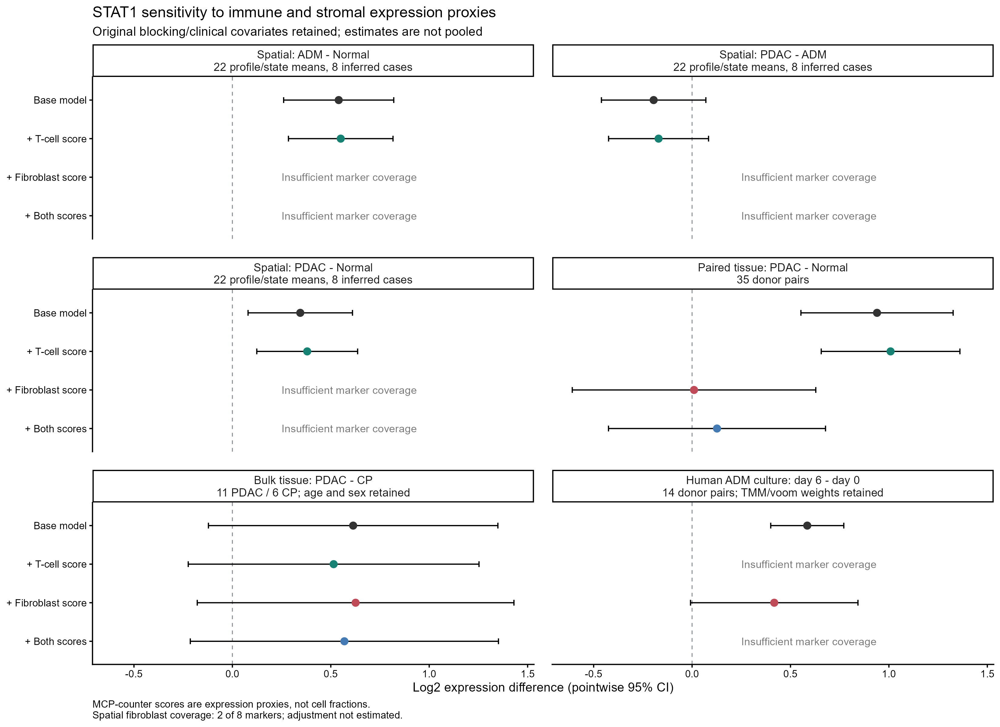
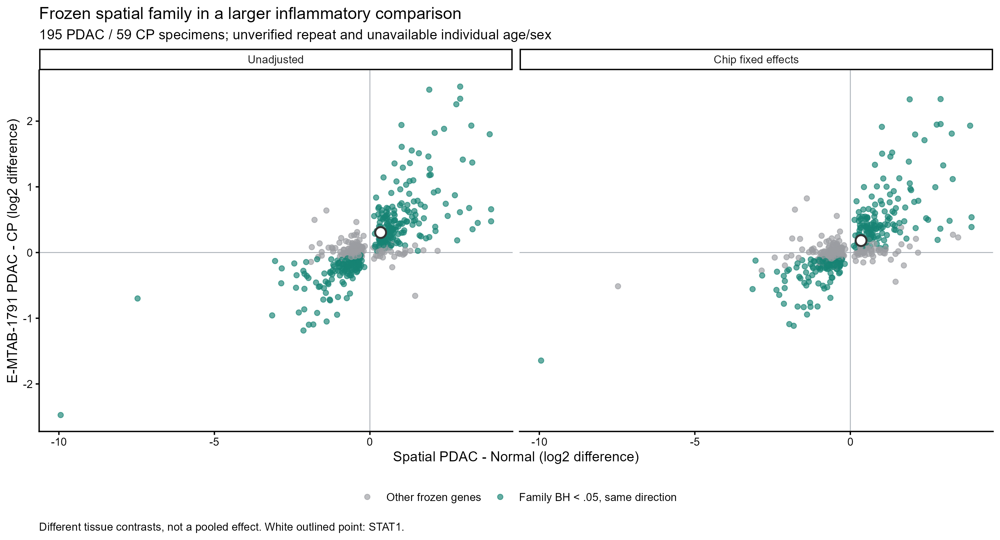

# Publication Audit: Metadata, Composition And Inflammatory Controls

Updated 2026-10-05. These are post hoc sensitivity analyses. The earlier primary results,
frozen families and PLCO predictions are unchanged. This report does not certify journal readiness.

## Spatial Case Identities

All eight distinct age/sex/grade/stage profiles match unique cases in Table 1 of the
[source article](https://doi.org/10.3389/fimmu.2022.961457). This corroborates the clinical-profile
crosswalk; it is not a directly deposited ROI-to-patient ID. A mislabeled profile would remain
undetectable from this comparison. The unusual ROI counts are retained, not repaired by guessing.

| Published_Case | Normal | ADM | PDAC |
| --- | --- | --- | --- |
| CASE1 | 2 | 2 | 2 |
| CASE2 | 3 | 1 | 2 |
| CASE3 | 0 | 2 | 2 |
| CASE4 | 2 | 2 | 2 |
| CASE5 | 2 | 0 | 2 |
| CASE6 | 2 | 1 | 2 |
| CASE7 | 2 | 6 | 2 |
| CASE8 | 3 | 2 | 2 |

The 48 ROIs yield 22 observed case/state means. Six inferred cases have all three states.
CASE3 lacks Normal; CASE5 lacks ADM. The source's general selection description does
not imply that every deposited case has exactly six ROIs. The original grouping is preserved.

## STAT1 Composition Sensitivity

[MCP-counter](https://doi.org/10.1186/s13059-016-1070-5) implementation and signatures are pinned
to commit b6eac73e91c246fcff0bb1a5c68a816cd588fc48. A named score must have at least three markers
and at least half its published markers to enter a model. This analyst-selected coverage rule
does not validate a truncated signature for a targeted spatial assay. Scores are standardized
within each cohort and are not cell fractions. STAT1 is not a signature marker. Baseline models
retain case/donor blocking or age and sex; ordinary spatial models and full-gene moderated
microarray models match the primary analysis. Covariate adjustment is conditional, not causal.

| Dataset | Comparison | Model | Effect | CI | P | Status |
| --- | --- | --- | --- | --- | --- | --- |
| GSE208536 | ADM_vs_Normal | Base model | 0.540 | 0.260 to 0.820 | 0.001214 | Estimated |
| GSE208536 | PDAC_vs_ADM | Base model | -0.195 | -0.461 to 0.070 | 0.134786 | Estimated |
| GSE208536 | PDAC_vs_Normal | Base model | 0.345 | 0.080 to 0.610 | 0.015111 | Estimated |
| GSE208536 | ADM_vs_Normal | + T-cell score | 0.550 | 0.285 to 0.816 | 0.000816 | Estimated |
| GSE208536 | PDAC_vs_ADM | + T-cell score | -0.170 | -0.424 to 0.084 | 0.168055 | Estimated |
| GSE208536 | PDAC_vs_Normal | + T-cell score | 0.380 | 0.124 to 0.636 | 0.007517 | Estimated |
| GSE208536 | ADM_vs_Normal | + Fibroblast score | Not estimated | Not estimated | Not estimated | Required score failed marker coverage or variance rule |
| GSE208536 | PDAC_vs_ADM | + Fibroblast score | Not estimated | Not estimated | Not estimated | Required score failed marker coverage or variance rule |
| GSE208536 | PDAC_vs_Normal | + Fibroblast score | Not estimated | Not estimated | Not estimated | Required score failed marker coverage or variance rule |
| GSE208536 | ADM_vs_Normal | + Both scores | Not estimated | Not estimated | Not estimated | Required score failed marker coverage or variance rule |
| GSE208536 | PDAC_vs_ADM | + Both scores | Not estimated | Not estimated | Not estimated | Required score failed marker coverage or variance rule |
| GSE208536 | PDAC_vs_Normal | + Both scores | Not estimated | Not estimated | Not estimated | Required score failed marker coverage or variance rule |
| GSE15471 | PDAC_vs_Normal | Base model | 0.940 | 0.553 to 1.326 | 1.76e-05 | Estimated |
| GSE15471 | PDAC_vs_Normal | + T-cell score | 1.008 | 0.656 to 1.361 | 1.21e-06 | Estimated |
| GSE15471 | PDAC_vs_Normal | + Fibroblast score | 0.010 | -0.609 to 0.629 | 0.974272 | Estimated |
| GSE15471 | PDAC_vs_Normal | + Both scores | 0.127 | -0.425 to 0.678 | 0.644010 | Estimated |
| GSE143754 | PDAC_vs_CP | Base model | 0.614 | -0.122 to 1.349 | 0.095995 | Estimated |
| GSE143754 | PDAC_vs_CP | + T-cell score | 0.514 | -0.224 to 1.253 | 0.158603 | Estimated |
| GSE143754 | PDAC_vs_CP | + Fibroblast score | 0.626 | -0.179 to 1.431 | 0.118102 | Estimated |
| GSE143754 | PDAC_vs_CP | + Both scores | 0.569 | -0.214 to 1.352 | 0.141670 | Estimated |
| GSE179248 | Culture_D6_vs_D0 | Base model | 0.585 | 0.400 to 0.771 | 3.26e-06 | Estimated |
| GSE179248 | Culture_D6_vs_D0 | + T-cell score | Not estimated | Not estimated | Not estimated | Required score failed marker coverage or variance rule |
| GSE179248 | Culture_D6_vs_D0 | + Fibroblast score | 0.417 | -0.008 to 0.843 | 0.053959 | Estimated |
| GSE179248 | Culture_D6_vs_D0 | + Both scores | Not estimated | Not estimated | Not estimated | Required score failed marker coverage or variance rule |

In GSE15471, fibroblast adjustment reduces the STAT1 tumor/normal estimate from +0.940
to +0.010 log2 units (95% CI -0.609 to +0.629). The broader conditional CI includes zero.
This is consistent with strong dependence on stromal-associated expression but does not prove
that fibroblasts explain the signal or identify the expressing compartment. Adjustment may
remove mediated biology and is affected by collinearity.

The spatial ADM/Normal estimate is +0.550 after T-cell adjustment (95% CI +0.285 to +0.816).
Only two of eight fibroblast markers are measured, so that spatial sensitivity cannot be fit.
The later PDAC/ADM contrast remains uncertain. There is no confirmed transient STAT1 peak.
The 11-PDAC/6-CP cohort provides no significant STAT1 difference in these adjusted variants.

All variants, unavailable models, pointwise CIs, exploratory model-family BH values, residual
degrees of freedom and condition numbers are saved. Do not select a favorable adjusted p-value.

### Additional Post Hoc Culture Check

After inspecting the initial three-cohort sensitivities, the same named proxies were added
to the already analyzed paired human ADM culture cohort. Donor blocking, outcome-independent
count filtering and TMM normalization were retained; voom weights were recomputed for each design.
Fibroblast-score adjustment changes the culture STAT1 effect from +0.585 to 0.417 log2 units (95% CI -0.008 to 0.843; p=0.054).
The adjusted culture interval includes zero. T-cell coverage fails the fixed eligibility rule,
so T-cell and combined models are not fitted. Expression proxies can change with cell state
as well as composition; this is not evidence of actual fibroblast accumulation in culture.

## Larger Inflammatory Cohort

E-MTAB-1791 contains 457 deposited records. The eligibility rule retains 195 explicitly PDAC
specimens and 59 pancreatitis specimens without an associated-tumor clinical-history label.
Nine tumor-associated pancreatitis specimens are excluded. The
[source publication](https://doi.org/10.1002/ijc.31087) reports 59 CP specimens from 58 patients.
The repeated patient cannot be identified from the SDRF. It reports aggregate median ages of
47.1 years in CP and 63.4 years in PDAC, but individual age/sex fields are not deposited in the SDRF.
Group means/medians are not substituted as covariates. The source's 452 quality-controlled
samples differ from the 457 deposited records; the primary tissue counts match the source.

The source normalized log2 column is parsed for each eligible array. Source byte counts,
ZIP CRCs where used, MD5s, probe order and annotations are checked. Entrez IDs map to
unambiguous current symbols; highest overall mean selects duplicate probes without using labels.
Prepared probe/gene matrices and selected mappings are retained. Models use robust, trend-moderated
limma. Unadjusted and estimable chip-fixed-effect contrasts are reported with all-gene BH and
separate BH across the measurable subset of the frozen 506 spatial genes.

### Design And Frozen-Family Results

| Model | Status | Chips | Mixed_Diagnosis_Chips | Design_Columns | Design_Rank | Residual_DF |
| --- | --- | --- | --- | --- | --- | --- |
| Unadjusted | Estimated | 85 | 23 | 2 | 2 | 252 |
| Chip_adjusted | Estimated | 85 | 23 | 86 | 86 | 168 |

| Model | All_Genes_Tested | All_Gene_BH_Significant | Measurable_Frozen | Frozen_BH_Significant | Same_Direction_As_Spatial | Spatial_And_CP_Concordant_Significant | Frozen_Significant_All_Omissions | Spearman_Effect_Correlation |
| --- | --- | --- | --- | --- | --- | --- | --- | --- |
| Chip_adjusted | 20121 | 7624 | 501 | 303 | 403 | 256 | 261 | 0.743361309254002 |
| Unadjusted | 20121 | 12160 | 501 | 377 | 394 | 322 | 364 | 0.783850943531264 |

Gene-direction counts and correlations are descriptive. The spatial PDAC/Normal and
bulk PDAC/CP comparisons have different controls and do not test the same tissue contrast.

### STAT1 In The Larger Cohort

| Model | Variant | log2FC | CI_low | CI_high | P | BH_all_genes | BH_frozen_base_family |
| --- | --- | --- | --- | --- | --- | --- | --- |
| Unadjusted | Unadjusted_for_composition | 0.305 | 0.185 | 0.424 | < 1e-06 | 4.10e-06 | 2.33e-06 |
| Unadjusted | Plus_T_cells | 0.270 | 0.156 | 0.384 | 5.11e-06 | 1.88e-05 | Not estimated |
| Unadjusted | Plus_Fibroblasts | 0.290 | 0.169 | 0.411 | 3.78e-06 | 1.56e-05 | Not estimated |
| Unadjusted | Plus_both | 0.266 | 0.150 | 0.381 | 9.00e-06 | 3.38e-05 | Not estimated |
| Chip_adjusted | Unadjusted_for_composition | 0.182 | 0.025 | 0.339 | 0.0236 | 0.0594 | 0.0402 |
| Chip_adjusted | Plus_T_cells | 0.200 | 0.047 | 0.353 | 0.0108 | 0.0301 | Not estimated |
| Chip_adjusted | Plus_Fibroblasts | 0.170 | 0.013 | 0.327 | 0.0340 | 0.0824 | Not estimated |
| Chip_adjusted | Plus_both | 0.192 | 0.038 | 0.346 | 0.0149 | 0.0415 | Not estimated |

The frozen-family BH column is evaluated for the two base models only. Composition
variants retain all-gene BH; their smaller exploratory model-family BH is saved separately.
These corrections answer different multiplicity questions and must not be interchanged.

The chip-adjusted base STAT1 effect is +0.182 log2 units (95% CI 0.025 to 0.339), with frozen-family BH=0.0402 but all-gene BH=0.0594.
It passes the narrower frozen-family threshold, not the all-gene threshold. The composition
variants must not be selected merely because their adjusted p-values are more favorable.

Every possible CP specimen is omitted in turn for each estimable base model. The saved
gene-level envelope reports effect and family-BH extrema, direction stability and the number
of estimable omissions. This is a sensitivity analysis for the unidentified repeat, not donor
blocking or verified independence. It does not remove the substantial age difference.

| Model | Estimable_Omissions | STAT1_Effect_Range | STAT1_AllGene_BH_Range | STAT1_Frozen_BH_Range | STAT1_Frozen_Significant_All_Omissions |
| --- | --- | --- | --- | --- | --- |
| Chip_adjusted | 59 | 0.160 to 0.245 | 0.00801 to 0.116 | 0.00471 to 0.0825 | FALSE |
| Unadjusted | 59 | 0.292 to 0.329 | <1e-06 to 1.09e-05 | <1e-06 to 6.36e-06 | TRUE |

Across all 59 chip-adjusted CP omissions, STAT1 remains positive (0.160 to 0.245), but frozen-family BH ranges from 0.00471 to 0.0825 and crosses 0.05.
Thus its direction is stable in this check, while threshold-level significance is not.

A PDAC/CP association in this cohort is not proof of malignancy specificity, because individual
clinical adjustment and a verified donor map are unavailable. Bulk composition scores also
cannot establish cellular origin or eliminate epithelial/acinar lineage effects.

## Consequences For Submission

The strongest current framing is a metadata-aware reproducibility and transportability study,
with separated tissue and circulating-marker evidence streams. The focused
[prior-art assessment](publication_prior_art.md) documents overlap with the source analyses and
existing tissue meta-analyses. It does not prove novelty.

Submission still requires a coherent manuscript that replaces the historical claims, attribution
to every source study, reconciled supplements, author review of the computational results and
journal-specific reporting/declarations. Direct ROI/patient IDs, individual clinical adjustment
for the larger cohort and untouched prediagnostic validation data remain unavailable. These
limits must be disclosed and the claims narrowed; they cannot be solved by more significant tests.

## Reproduction

See [the dated sensitivity specification](publication_sensitivity_protocol.md), scripts 18-23,
the source/array manifests in data/publication, and reanalysis/results/publication. All new figures
are supplied in PNG and PDF. The old PLCO scores and thresholds are not retuned.

## Output Index

| Artifact | Contents |
| --- | --- |
| [Spatial crosswalk](../reanalysis/results/publication/GSE208536_published_case_crosswalk.csv) | All 48 ROIs, inferred profiles and corroborating published case labels |
| [Composition models](../reanalysis/results/publication/STAT1_composition_sensitivity.csv) | All 24 named variants, including unavailable adjustments |
| [Marker coverage](../reanalysis/results/publication/MCPcounter_marker_coverage.csv) | All ten populations in four existing tissue/culture cohorts |
| [Source inputs](../data/publication/publication_download_manifest.csv) | Source URLs, byte counts and checksums |
| [Eligibility audit](../reanalysis/results/publication/E-MTAB-1791_eligibility_mapping.csv) | All 457 records and exact inclusion/exclusion roles |
| [Array manifest](../data/publication/E-MTAB-1791_array_manifest.csv) | All 254 source arrays and checked preparation records |
| [Gene/probe map](../data/publication/E-MTAB-1791_selected_probe_map.csv) | Outcome-blind selected probes and symbol mappings |
| [Larger-cohort models](../reanalysis/results/publication/E-MTAB-1791_models.csv) | All eight designs, estimability, residual degrees of freedom and condition numbers |
| [All-gene contrasts](../reanalysis/results/publication/E-MTAB-1791_all_gene_contrasts.csv) | Unadjusted and chip-adjusted effects, pointwise CIs and all-gene BH |
| [Frozen family](../reanalysis/results/publication/E-MTAB-1791_frozen_spatial_family.csv) | Measurable frozen genes, directions and separate family BH |
| [Omission envelope](../reanalysis/results/publication/E-MTAB-1791_omit_one_CP_envelope.csv) | All possible single-CP omissions and gene-level sensitivity extrema |
| [Output checks](../reanalysis/provenance/publication_output_checks.txt) | Numerical/structural checks; not certification of biological truth |
